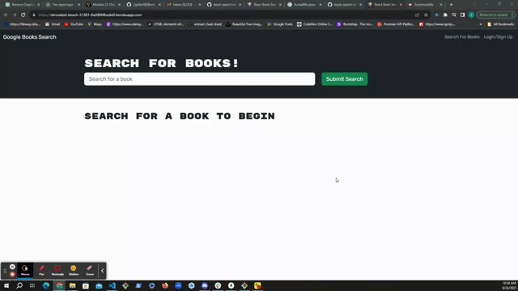

# Book Search Engine Refactor

## Description
This is a refactor of a fully functioning Google Books API search engine, built with a RESTful API, into a GraphQL API using Apollo Server. The application is designed for readers who want to search for new books to read and keep a list of books to purchase. It utilizes the MERN stack, consisting of a React front end, MongoDB database, and Node.js/Express.js server and API. Users can search for books and once logged in, can save books to their account. They can view their saved books and delete any of their saved books.

## Table of Contents
- [Usage](#usage)
- [Technologies](#technologies)
- [Contributing](#contributing)
- [License](#license)

## Usage

Visit the deployed application [here](https://shrouded-beach-51381-8a380f4bede0.herokuapp.com/). The homepage displays a search bar, navigation links, and the option to log in or sign up. Once logged in, you can save and delete books.

### Login/Signup

### Search and Save Books

### Delete Books and Logout

## Technologies
- [React](https://react.dev/) - Component based JavaScript language for developing UI's.
- [Bootstrap](https://getbootstrap.com/) - CSS framework.
- [bcrypt](https://www.npmjs.com/package/bcrypt) - Used for securely hashing passwords in databases.
- [jwt](https://jwt.io/) - Used for authentication and authorization in web applications.
- [MongoDb](https://www.mongodb.com/)- A NoSQL database.
- [Mongoose](https://mongoosejs.com/docs/) - ODM library for Node.js and MongoDB.
- [GraphQL](https://graphql.org/) - Query language for APIs to rquest only the data needed.
- [apollo/server](https://www.apollographql.com/docs/apollo-server) -  GraphQL server that allows developers to build a production-ready API
- [NodeJS](https://nodejs.org/en) - A JavaScript runtime environment that enables server-side scripting
- [ExressJS](https://expressjs.com/) -  Node.js web application framework.

## Contributing
Contributions are welcome! If you have any ideas, suggestions, or bug reports, please open an issue or submit a pull request.

## License
This project is licensed under the MIT License - see the [LICENSE](https://opensource.org/licenses/MIT) file for details.

